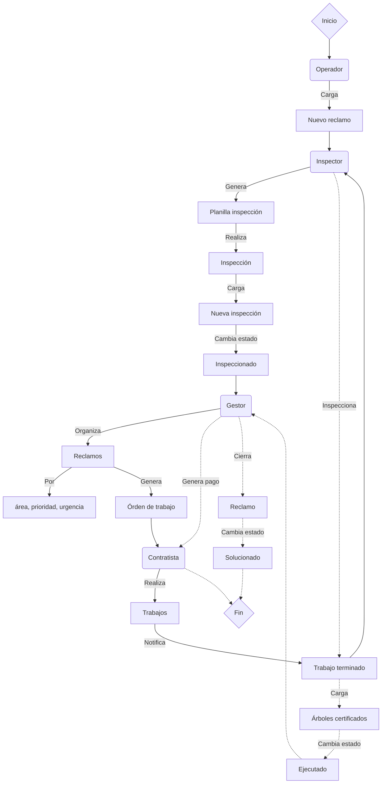
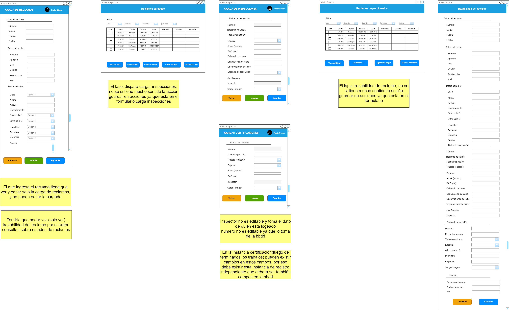

# Sistema de Gestión de Reclamos

## Grupo 8

### Integrantes

- *Emiliano Salvadeo* - [emilianoSalva](https://github.com/emilianoSalva)
- *Ezequiel Mazzini* - [ezequielmazzini](https://github.com/ezequielmazzini)
- *Humberto Sbertoli* - [Elmerex](https://github.com/Elmerex)
- *Sergio Tolaba* - [Sergio395](https://github.com/Sergio395)
- *Cristian Lahoz* - [m415x](https://github.com/m415x)

## Descripción

El Sistema de Gestión de Reclamos de arbolado público es una aplicación web que permite la gestión de los reclamos de la ciudadanía sobre el arbolado público. La aplicación cuenta con cuatro roles de usuario, cada uno con distintas funcionalidades:

-*Operador*

- Carga de reclamos
- Seguimiento de reclamos
- Búsqueda de reclamos

-*Inspector*

- Búsqueda de reclamos
- Generación de planilla de inspección
- Carga de reclamo por árbol
- Carga de trabajo terminado
- Edición de reclamos

-*Gestor*

- Búsqueda de reclamos
- Asignación de reclamos a contratistas
- Confirmación de pagos
- Edición de reclamos

-*Administrador*

- Alta de usuarios
- Asignación de roles
- Alta de contratistas

### Flujo de trabajo



<!-- ### UX-UI (preliminar)


### Formularios de reclamos



### Diagrama de Clases


### Diagrama Entidad-Relación (DER)

 -->

### Estructura del proyecto

```text
gestion_reclamos/
├── apps/
│   ├── administracion/
│   │   ├── migrations/
│   │   ├── __init__.py
│   │   ├── admin.py
│   │   ├── apps.py
│   │   ├── forms.py
│   │   ├── models.py
│   │   ├── tests.py
│   │   ├── urls.py
│   │   └── views.py
│   ├── base/
│   │   ├── constants/
│   │   │   ├── __init__.py
│   │   │   ├── calles_choices.py
│   │   │   └── choices.py
│   │   ├── decorators/
│   │   │   ├── __init__.py
│   │   │   └── decorators.py
│   │   ├── migrations/
│   │   ├── __init__.py
│   │   ├── admin.py
│   │   ├── apps.py
│   │   ├── models.py
│   │   ├── tests.py
│   │   ├── urls.py
│   │   └── views.py
│   ├── gestion/
│   │   ├── migrations/
│   │   ├── __init__.py
│   │   ├── admin.py
│   │   ├── apps.py
│   │   ├── forms.py
│   │   ├── models.py
│   │   ├── tests.py
│   │   ├── urls.py
│   │   └── views.py
│   ├── inspeccion/
│   │   ├── migrations/
│   │   ├── __init__.py
│   │   ├── admin.py
│   │   ├── apps.py
│   │   ├── forms.py
│   │   ├── models.py
│   │   ├── tests.py
│   │   ├── urls.py
│   │   └── views.py
│   ├── reclamos/
│   │   ├── migrations/
│   │   ├── templatetags/
│   │   │   ├── __init__.py
│   │   │   └── custom_filters.py
│   │   ├── utils/
│   │   │   ├── __init__.py
│   │   │   └── signals.py
│   │   ├── __init__.py
│   │   ├── admin.py
│   │   ├── apps.py
│   │   ├── forms.py
│   │   ├── models.py
│   │   ├── tests.py
│   │   ├── urls.py
│   │   └── views.py
│   ├── relevamiento/
│   │   ├── migrations/
│   │   ├── __init__.py
│   │   ├── admin.py
│   │   ├── apps.py
│   │   ├── forms.py
│   │   ├── models.py
│   │   ├── tests.py
│   │   ├── urls.py
│   │   └── views.py
│   └── __init__.py
├── db-definition/
│   └── create-database.sql
├── gestion_reclamos/
│   ├── __init__.py
│   ├── .env
│   ├── asgi.py
│   ├── settings.py
│   ├── urls.py
│   └── wsgi.py
├── static/
│   ├── administracion/
│   │   ├── css/
│   │   └── js/
│   ├── assets/
│   │   ├── css/
│   │   ├── img/
│   │   ├── js/
│   │   └── vendor/
│   ├── inspeccion/
│   │   └── js/
│   └── reclamos/
│       └── js/
├── templates/
│   ├── administracion/
│   │   ├── 404_admin.html
│   │   ├── admin_index.html
│   │   ├── edit_empresa.html
│   │   ├── edit_usuario.html
│   │   ├── ediar_oc.html
│   │   ├── empresas.html
│   │   ├── nueva_empresa.html
│   │   ├── nueva_oc.html
│   │   ├── nuevo_usuario.html
│   │   ├── ordenes_compra.html
│   │   └── usuarios.html
│   ├── base/
│   │   ├── base_admin.html
│   │   ├── base_filters.html
│   │   ├── base.html
│   │   ├── footer.html
│   │   └── index.html
│   ├── gestion/
│   │   ├── editar_prueba.html
│   │   ├── gestion_editar_reclamo.html
│   │   ├── gestion_editar.html
│   │   ├── gestion_form.html
│   │   ├── gestion_index.html
│   │   ├── gestion_inicio.html
│   │   ├── gestion_lista.html
│   │   ├── gestion_nuevo.html
│   │   ├── gestion_prueba.html
│   │   ├── gestioncbv_borrar.html
│   │   ├── gestioncbv_detalle.html
│   │   ├── gestioncbv_editar.html
│   │   ├── gestioncbv_lista.html
│   │   ├── gestioncbv_nuevo.html
│   │   ├── gestionsolocbv_detalle.html
│   │   └── inspeccioncbv_lista.html
│   ├── inspeccion/
│   │   ├── inspeccion_editar.html
│   │   ├── inspeccion_form.html
│   │   ├── inspeccion_index.html
│   │   ├── inspeccion_listar.html
│   │   ├── inspeccion_mostrar.html
│   │   ├── inspecciones.html
│   │   ├── nueva_certificacion.html
│   │   └── nueva_inspeccion.html
│   ├── reclamos/
│   │   ├── reclamo_form_validaciones.html
│   │   ├── reclamo_form.html
│   │   └── reclamo_list.html
│   └── registracion/
│       ├── _base_site.html
│       ├── _base.html
│       ├── _logged_out.html
│       ├── _login.html
│       ├── password_change_done.html
│       ├── password_change_form.html
│       ├── password_change.html
│       ├── password_reset_complete.html
│       ├── password_reset_confirm.html
│       ├── password_reset_done.html
│       ├── password_reset_email.html
│       └── password_reset_form.html
├── .gitignore
├── manage.py
├── README.md
└── requirements.txt
```

## Requisitos del sistema

- [Python 3.9 o superior](https://www.python.org/downloads/)
- [PostgreSQL 14 o superior](https://www.postgresql.org/download/)
- [GIT 2.40 o superior](https://git-scm.com/downloads)

## Instalación

1. Clonar el repositorio desde git bash

    >```bash
    >git clone https://github.com/Sergio395/gestion_reclamos.git
    >```

2. Acceder a la carpeta del proyecto

    >```bash
    >cd ruta/gestion_reclamos
    >```

3. Crear un entorno virtual

    >```bash
    >python -m venv "nombre_entorno_virtual" 
    >```

4. Activar el entorno virtual

    >*Linux / macOS*
    >
    >```bash
    >ruta_al_entorno_virtual/nombre_entorno_virtual/bin/activate
    >```
    >
    >*Windows*
    >
    >```bash
    >ruta_al_entorno_virtual\nombre_entorno_virtual\Scripts\activate
    >```

5. Instalar las dependencias

    >```bash
    >pip install -r requirements.txt
    >```

6. Crear la base de datos en PostgreSQL:

    1. Abre pgAdmin y haz clic derecho en “Databases”.
    2. Selecciona “Create” y luego “Database”.
    3. Ingresa el nombre de la base de datos y selecciona el propietario.

7. Crear el archivo '.env' en la carpeta 'gestion_reclamos' con los siguientes parámetros

    >```text
    >SECRET_KEY = 'clave_del_entorno'
    >DEBUG = True
    >
    >DATABASE_NAME = 'gestion_reclamos_db'
    >DATABASE_HOST = 'localhost'
    >DATABASE_PORT = ''
    >DATABASE_USER = 'nombre_de_usuario'
    >DATABASE_PASSWORD = 'password'
    >
    >EMAIL_HOST = 'smtp-relay.sendinblue.com'
    >EMAIL_PORT = '587'
    >EMAIL_USE_TLS = True
    >EMAIL_HOST_USER = 'email'
    >EMAIL_HOST_PASSWORD = 'password'
    >RECIPIENT_ADDRESS = ''
    >````

8. Crear las tablas de la base de datos

    >```bash
    >python manage.py migrate
    >````

9. Crear un usuario administrador

    >```bash
    >python manage.py createsuperuser
    >````

10. Ejecutar el servidor local

    >```bash
    >python manage.py runserver
    >````

11. Acceder a <http://localhost:8000/> en el navegador

<!-- ## Ejecutando las pruebas

_Explica como ejecutar las pruebas automatizadas para este sistema_

### Analice las pruebas end-to-end

_Explica que verifican estas pruebas y por qué_

```
Da un ejemplo
```

### Y las pruebas de estilo de codificación

_Explica que verifican estas pruebas y por qué_

```
Da un ejemplo
```

## Despliegue

_Agrega notas adicionales sobre como hacer deploy_ -->

## Construido con

- [Django 3.2](https://docs.djangoproject.com/en/4.1/releases/3.2/) - El framework web utilizado
- [Bootstrap 5.2](https://getbootstrap.com/docs/5.2/getting-started/introduction/) - El framework css implementado

<!-- ## Contribuyendo

Este proyecto está abierto a contribuciones de la comunidad. Si desea contribuir, por favor lea [CONTRIBUTING.md](CONTRIBUTING.md) para obtener más información. -->

<!-- ## Versionado

Usamos [SemVer](http://semver.org/) para el versionado. Para todas las versiones disponibles, mira los [tags en este repositorio](https://github.com/tu/proyecto/tags). -->

<!-- ## Autores

- *Emiliano Salvadeo* - [emilianoSalva](https://github.com/emilianoSalva)
- *Ezequiel Mazzini* - [ezequielmazzini](https://github.com/ezequielmazzini)
- *Humberto Sbertoli* - [Elmerex](https://github.com/Elmerex)
- *Sergio Tolaba* - [Sergio395](https://github.com/Sergio395)
- *Cristian Lahoz* - [m415x](https://github.com/m415x) -->

<!-- ## Licencia

Este proyecto está disponible bajo la Licencia MIT. Consulte [LICENSE.md](LICENSE.md) para obtener más información. -->
